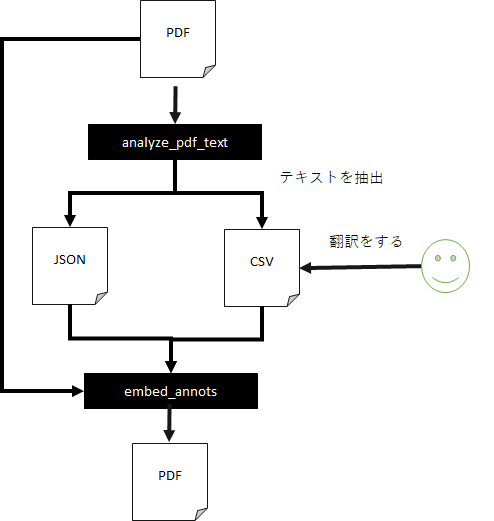
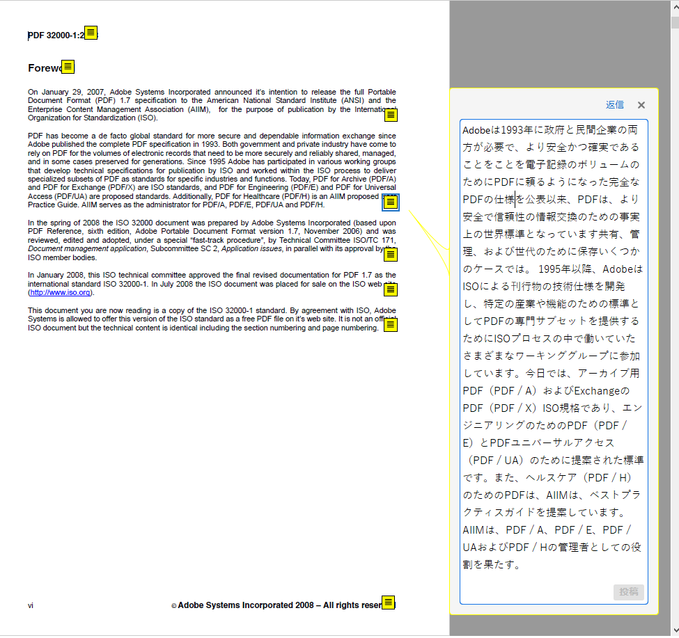
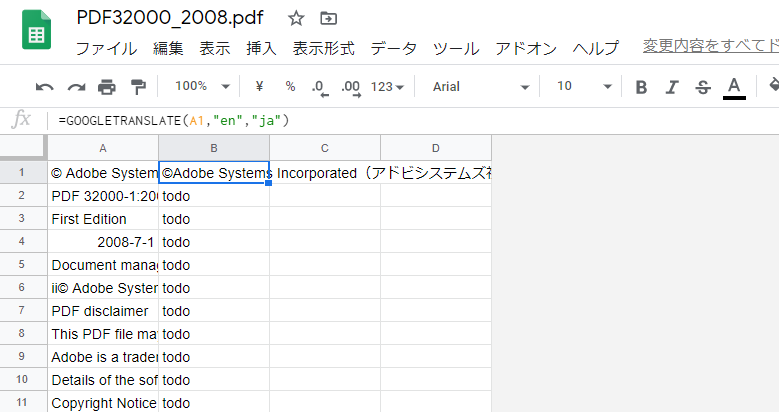
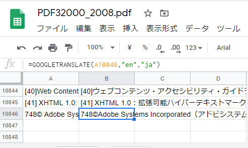

# pdf_translate
PDFの翻訳ツール。
このツールは翻訳結果をPDFの注釈として埋め込むツールです。



翻訳対象のPDFから、そのテキスト情報と位置を記録したJSONと、テキストの一覧を記録したCSVを作成します。
次に任意の方法でCSVに記録したテキストを翻訳します。
最後に翻訳対象のPDFとJSON,CSVを使用して新しいPDFを作成します。
そのPDFには翻訳した文字が注釈として表示されます。



このように元のレイアウトを保持しつつ、訳を確認することが可能になります。
また、一旦、翻訳対象のテキストをCSVに格納することにより、機械翻訳をしやすくするとともに、複数人での人力での翻訳も行えます。

# 動作環境
Python 3.7.5  

## 依存ライブラリ
 - [tqdm](https://pypi.org/project/tqdm/)              4.45.0　　
 - [PyMuPDF](https://pypi.org/project/PyMuPDF/)           1.16.18　　
 
 # 使用方法
 実際に下記のPDFを翻訳する例を説明します。  
 https://www.adobe.com/content/dam/acom/en/devnet/acrobat/pdfs/PDF32000_2008.pdf
 
1. PDFを任意のフォルダにダウンロードします。  
 
2. 下記のコマンドを使用して翻訳対象のPDFから、そのテキスト情報と位置を記録したJSONと、テキストの一覧を記録したCSVを作成します。

```
analyze_pdf_text.py PDF32000_2008.pdf
```

3. 下記のファイルが作成されている事を確認します。  

 - PDF32000_2008.pdf.json
 - PDF32000_2008.pdf.csv

4. PDF32000_2008.pdf.csvをGoogleスプレッドにアップロードします。  

5. セルB1に数式「=GOOGLETRANSLATE(A1,"en","ja")」を入力します。  



6. セルB1を全てのB列にコピーします。「Loading...」という文字がなくなるまで待ってください（時間がかかります）  



7. CSV形式でダウンロードして、元のPDF32000_2008.pdf.csvに上書きします。  

8. 下記のコマンドを実行して訳を注釈として埋め込みます  

```
python embed_annots.py PDF32000_2008.pdf.json output.pdf
```
