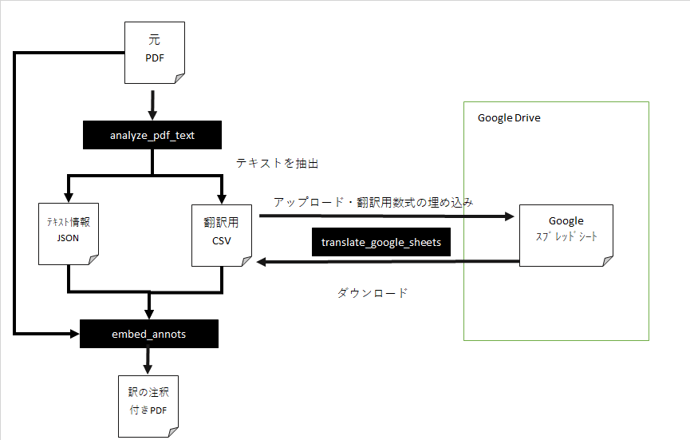
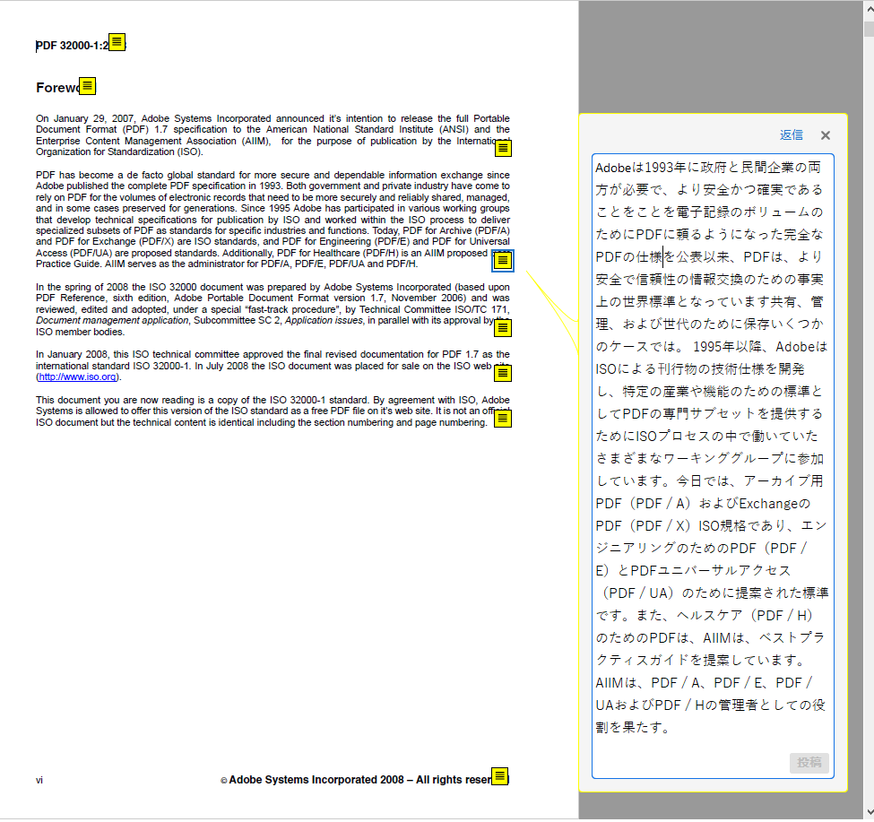

# pdf_translate
PDFの翻訳ツール。
このツールは翻訳結果をPDFの注釈として埋め込むツールです。



翻訳対象のPDFから、そのテキスト情報と位置を記録したJSONと、テキストの一覧を記録したCSVを作成します。
次に任意の方法でCSVに記録したテキストをGoogleのスプレッドシートの数式を用いて翻訳します。
最後に翻訳対象のPDFとJSON,CSVを使用して新しいPDFを作成します。
そのPDFには翻訳した文字が注釈として表示されます。



このように元のレイアウトを保持しつつ、訳を確認することが可能になります。
また、一旦、翻訳対象のテキストをCSVに格納するので、後で人力での翻訳も行えます。

# 動作環境
Python 3.7.5  

## 依存ライブラリ
 - [tqdm](https://pypi.org/project/tqdm/)              4.45.0　　
 - [PyMuPDF](https://pypi.org/project/PyMuPDF/)           1.16.18　　
 - [google-api-python-client](https://pypi.org/project/google-api-python-client/)   1.8.2
 - [google-auth-httplib2](https://pypi.org/project/google-auth-httplib2/) 0.0.3
 - [google-auth-oauthlib](https://pypi.org/project/google-auth-oauthlib/) 0.4.1


## 事前準備
下記のクイックスターとを実行してGoogleDriveAPIとGoogle Sheets APIを実行できる環境を用意してください。

Google Drive API- Python Quickstart
https://developers.google.com/drive/api/v3/quickstart/python

Google Sheets API- Python Quickstart
https://developers.google.com/sheets/api/quickstart/python

また、この時作成される認証用の情報を格納したJSONを使用します。


# 使用方法
 実際に下記のPDFを翻訳する例を説明します。  
 https://www.adobe.com/content/dam/acom/en/devnet/acrobat/pdfs/PDF32000_2008.pdf
 
1. PDFを任意のフォルダにダウンロードします。  
 
2. 下記のコマンドを使用して翻訳対象のPDFから、そのテキスト情報と位置を記録したJSONと、テキストの一覧を記録したCSVを作成します。

```
python ./analyze_pdf_text.py PDF32000_2008.pdf
```

3. 下記のファイルが作成されている事を確認します。  

 - PDF32000_2008.pdf.json
 - PDF32000_2008.pdf.csv

4. PDF32000_2008.pdf.csvの2列目に訳を入力します。  
今回はGoogleスプレッドシートにアップロードしてGOOGLETRANSLATE数式で翻訳を行います。  
これを自動化したスクリプトは以下のようになります。  

```
python ./translate_google_sheets.py PDF32000_2008.pdf.csv client_secret.json
```


5. 下記のコマンドを実行して訳を注釈として埋め込みます  

```
python ./embed_annots.py PDF32000_2008.pdf.json output.pdf
```

以下が実際、注釈を付与したPDFになります。

http://needtec.sakura.ne.jp/doc/tmp/output.pdf

**注意**

 - オリジナルに比べてサイズが大きくなっている
 - Adobe Acrobat Readerで閲覧しないと旨く表示されない
   - WindowsのChromeの場合、ブラウザで見ると文字化けする。
   - スマホのPDFViewerで閲覧すると注釈のポップアップが表示されない。
